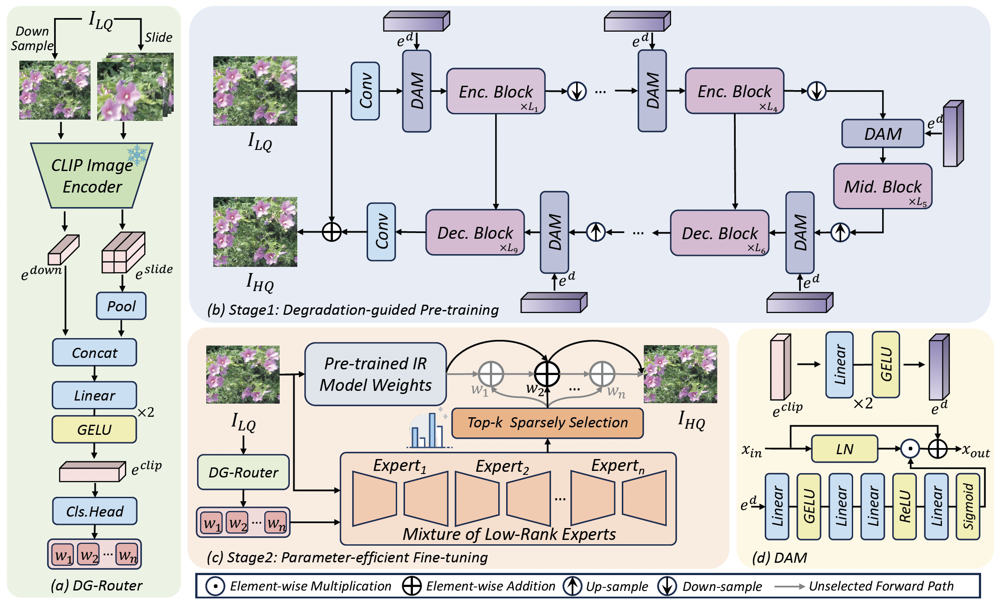

<div align="center">

<div class="logo">
      
   </a>
</div>


<h1>LoRA-IR: Taming Low-Rank Experts for Efficient All-in-One Image Restoration</h1>


<div>
    <a href='https://scholar.google.com/citations?user=2Qp7Y5kAAAAJ' target='_blank'>Yuang Ai</a><sup>1,2</sup>&emsp;
    <a href='https://scholar.google.com/citations?user=XMvLciUAAAAJ' target='_blank'>Huaibo Huang</a><sup>1,2</sup>&emsp;
    <a href='https://scholar.google.com/citations?user=ayrg9AUAAAAJ' target='_blank'>Ran He</a><sup>1,2</sup>
</div>
<div>
    <sup>1</sup>MAIS & NLPR, Institute of Automation, Chinese Academy of Sciences&emsp;<br>
    <sup>2</sup>School of Artificial Intelligence, University of Chinese Academy of Sciences&emsp;
</div>
<div>
</div>
<div>
    <strong>arXiv 2024</strong>
</div>


<div>
    <h4 align="center">
        <a href="" target='_blank'>
        
        </a>
        <a href="https://huggingface.co/shallowdream204/LoRA-IR/tree/main" target='_blank'>
        
        </a>
    </h4>
</div>


⭐ If LoRA-IR is helpful to your projects, please help star this repo. Thanks! 🤗


</div>

<be>


## 🔥 News
- **2024.10.20**: Release training&inference code, pre-trained models of Setting Ⅰ.
- **2024.10.20**: This repo is created.

## 🏗️ Overall Framework


## 🔧 Dependencies and Installation

1. Clone this repo and navigate to LoRA-IR folder

   ```bash
   git clone https://github.com/shallowdream204/LoRA-IR.git
   cd LoRA-IR
   ```

2. Create Conda Environment and Install Package

   ```bash
   conda create -n lorair python=3.11 -y
   conda activate lorair
   conda install pytorch==2.3.1 torchvision==0.18.1 torchaudio==2.3.1 pytorch-cuda=12.1 -c pytorch -c nvidia
   pip3 install -r requirements.txt
   python3 setup.py develop --no_cuda_ext
   ```

## ⚡ Train & Inference
Training and Testing instructions for different settings are  provided in their respective directories. Here is a summary table containing hyperlinks for easy navigation:

<table>
  <tr>
    <th align="left">Setting</th>
    <th align="center">Training Instructions</th>
    <th align="center"> Evaluation Instructions</th>
    <th align="center">Pre-trained Models</th>
  </tr>
  <tr>
    <td align="left">Setting Ⅰ</td>
    <td align="center"><a href="Setting1/README.md#Train">Link</a></td>
    <td align="center"><a href="Setting1/README.md#Evaluation">Link</a></td>
    <td align="center"><a href="https://huggingface.co/shallowdream204/LoRA-IR/tree/main">Download</a></td>
  </tr>
</table>

## 🪪 License

The provided code and pre-trained weights are licensed under the [Apache 2.0 license](LICENSE).

## 🤗 Acknowledgement

This code is based on [NAFNet](https://github.com/megvii-research/NAFNet) and [BasicSR](https://github.com/XPixelGroup/BasicSR). Some code are brought from [loralib](https://github.com/microsoft/LoRA), [LLaVA](https://github.com/haotian-liu/LLaVA) and [Restormer](https://github.com/swz30/Restormer). We thank the authors for their awesome work.

## 📧 Contact
If you have any questions, please feel free to reach me out at shallowdream555@gmail.com. 

## 📖 Citation
If you find our work useful for your research, please consider citing our paper:
```
@article{ai2024lora,
      title={LoRA-IR: Taming Low-Rank Experts for Efficient All-in-One Image Restoration},
      author={Ai, Yuang and Huang, Huaibo, and He, Ran},
      year={2024}
}
```
